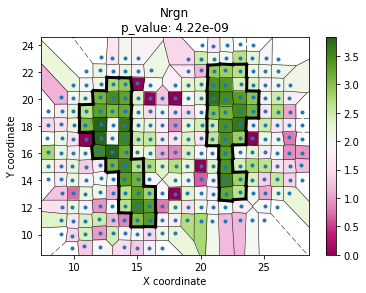

## scGCO

**scGCO** is a method to identify genes demonstrating position-dependent differential expression patterns, also known as spatially viable genes, using the powerful graph cuts algorithm. ScGCO can analyze spatial transcriptomics data generated by diverse technologies, including but not limited to single-cell RNA-sequencing, or *in situ* FISH based methods.
 
This repository contains source codes of scGCO, and tutorials on running the program.

The primary implementation is as a Python 3 package,and can be installed from the command line by

	pip install scgco
	
scGCO is friendly for Linux (UNIX-like systems),Mac OS X and Windows.**scGCO** depended pygco,shapely,matplotlib (matplotlib<3.0.0,>=2.0.0) and so on.Maybe there are some touble about shapely when install scGCO on Windows, you can firstly install shapely by 
'''
conda install shapely
'''
	

### License
MIT Licence, see LICENSE file.

###  Authors
See AUTHORS file.

### Contact
For bugs,feedback or help you can contact Peng Wang <wangpeng@picb.ac.cn>.


## Example usage of scGCO

As an example, let’s analyze spatially variable gene expression in Mouse Olfactory Bulb using a data set published in [Ståhl et al 2016](http://science.sciencemag.org/content/353/6294/78). 

### Input Format
The required matrix format is the ST data format, a matrix of counts where spot coordinates are row names and the gene names are column names. This matrix format (.TSV) is split by tab.


```python
import scGCO

# read spatial expression data
ff = 'notebooks/data/Rep11_MOB_count_matrix-1.tsv'
locs, data = scGCO.read_spatial_expression(ff)
# remove genes expressed in less than 10 cells
data = data.loc[:,(data != 0).astype(int).sum(axis=0) >= 10]
# normalize expression and use 1000 genes to test the algorithm
data_norm = scGCO.normalize_count_cellranger(data)
data_norm = data_norm.iloc[:,0:1000]
import time
# estimate number of segments
factor_df, size_factor = scGCO.estimate_smooth_factor(locs, data_norm)
start_ts = time.time()
# run the main algorithm to identify spatially expressed genes
# this should take less than a minute 
result_df = scGCO.identify_spatial_genes(locs, data_norm, size_factor)
end_ts = time.time()
print('seconds to run: ', end_ts-start_ts)
```

    100%|████████████████████████████████████████████| 8/8 [00:29<00:00,  4.47s/it]
    100%|████████████████████████████████████████████| 8/8 [01:08<00:00,  9.36s/it]
    

    seconds to run:  69.54099988937378
    


```python
# select spatially expressed gene with fdr < 0.01
fdr01 = result_df[result_df.fdr < 0.01].sort_values(by=['fdr'])
# visualize top genes
scGCO.visualize_spatial_genes(fdr01.iloc[0:10,], locs, data_norm)
# save top genes to pdf
scGCO.multipage_pdf_visualize_spatial_genes(fdr01.iloc[0:10,], locs, data_norm, 'top_genes.pdf')
```


```python
# You can also analyze one gene of interest

geneID='Nrgn' # Lets use Nrgn as an example
unary_scale_factor = 100 # scale factor for unary energy, default value works well

# set smooth factor to 20; 
# use bigger smooth_factor to get less segments
# use small smooth_factor to get more segments
smooth_factor=20 

ff = 'notebooks/data/Rep11_MOB_count_matrix-1.tsv' 
# read in spatial gene expression data
locs, data = scGCO.read_spatial_expression(ff)

# normalize gene expression
data_norm = scGCO.normalize_count_cellranger(data)

# select Nrgn's expression
exp =  data_norm.loc[:,geneID]

# log transform
exp=(scGCO.log1p(exp)).values

# create graph representation of spatial coordinates of cells
cellGraph = scGCO.create_graph_with_weight(locs, exp)

# do graph cut
newLabels, gmm = scGCO.cut_graph_general(cellGraph, exp, unary_scale_factor, smooth_factor)
# calculate p values
p, node, com = scGCO.compute_p_CSR(newLabels, gmm, exp, cellGraph)

# Visualize graph cut results
scGCO.plot_voronoi_boundary(geneID, locs, exp,  newLabels, min(p)) 

# save the graph cut results to pdf
scGCO.pdf_voronoi_boundary(geneID, locs, exp, newLabels, min(p),  'Nrgn.pdf')

```




